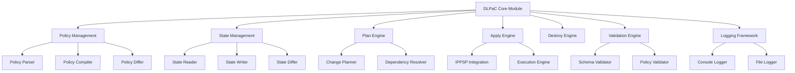
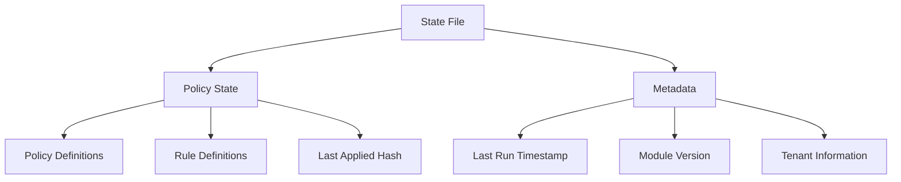
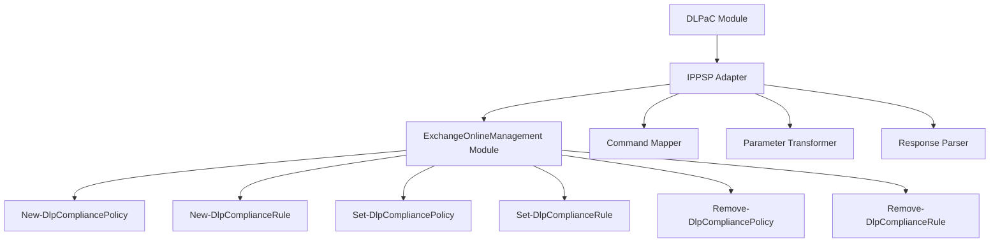
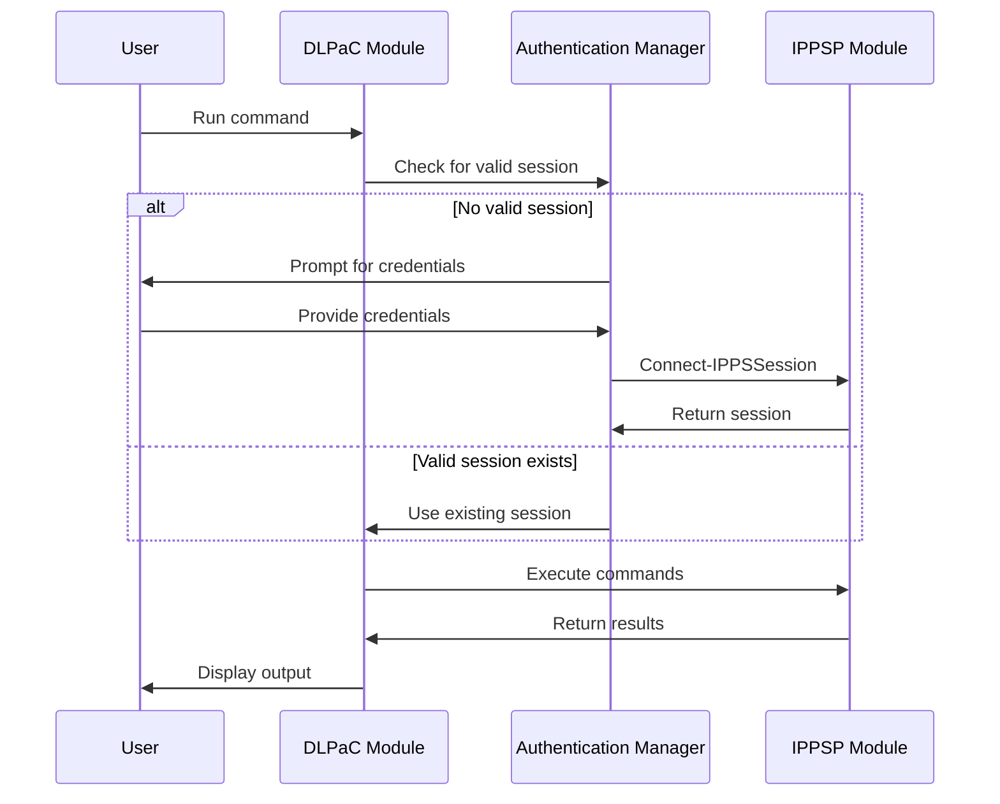
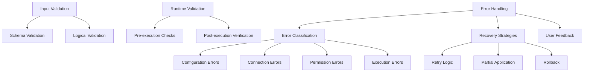
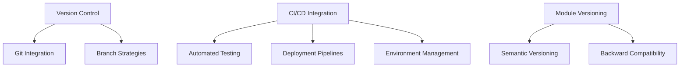
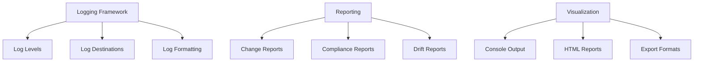
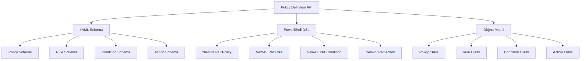

# PowerShell DLP-as-Code (DLPaC) Module Architectural Design

## 1. Module Structure and Component Breakdown

The module will follow a modular architecture with clear separation of concerns:



### Core Components:

1. **DLPaC Core Module**: The main module that orchestrates all operations and provides the public interface.

2. **Policy Management**:
   - **Policy Parser**: Converts YAML policy definitions into PowerShell objects
   - **Policy Compiler**: Transforms policy objects into IPPSP-compatible commands
   - **Policy Differ**: Identifies differences between desired and actual policies

3. **State Management**:
   - **State Reader**: Reads the current state file
   - **State Writer**: Writes updated state to the state file
   - **State Differ**: Compares current state with desired state

4. **Plan Engine**:
   - **Change Planner**: Determines what changes need to be made
   - **Dependency Resolver**: Ensures changes are applied in the correct order

5. **Apply Engine**:
   - **IPPSP Integration**: Interfaces with the ExchangeOnlineManagement module
   - **Execution Engine**: Executes the planned changes

6. **Destroy Engine**: Handles the removal of policies and rules

7. **Validation Engine**:
   - **Schema Validator**: Validates YAML against the schema
   - **Policy Validator**: Validates policy logic and dependencies

8. **Logging Framework**:
   - **Console Logger**: Outputs information to the console
   - **File Logger**: Writes logs to files

## 2. Workflow Patterns Implementation Approach

The module will implement Terraform-like workflow patterns:

```mermaid
sequenceDiagram
    participant User
    participant Init as DLPaC Init
    participant Plan as DLPaC Plan
    participant Apply as DLPaC Apply
    participant Destroy as DLPaC Destroy
    
    User->>Init: Initialize workspace
    Init->>User: Workspace ready
    
    User->>Plan: Plan changes
    Plan->>Plan: Parse YAML configs
    Plan->>Plan: Fetch current state
    Plan->>Plan: Compare desired vs. current
    Plan->>User: Display planned changes
    
    User->>Apply: Apply changes
    Apply->>Apply: Execute planned changes
    Apply->>Apply: Update state file
    Apply->>User: Report successful application
    
    User->>Destroy: Destroy resources
    Destroy->>Destroy: Plan removal of resources
    Destroy->>Destroy: Execute removal
    Destroy->>Destroy: Update state file
    Destroy->>User: Report successful destruction
```

### Workflow Commands:

1. **Initialize (`Initialize-DLPaCWorkspace`)**:
   - Creates necessary folder structure
   - Initializes empty state file
   - Validates environment (PowerShell version, modules)

2. **Plan (`Get-DLPaCPlan`)**:
   - Parses YAML configuration files
   - Retrieves current state from M365 tenant
   - Compares desired configuration with current state
   - Generates a plan file detailing changes to be made
   - Displays a summary of planned changes

3. **Apply (`Invoke-DLPaCApply`)**:
   - Executes the changes specified in the plan
   - Updates the state file with the new state
   - Provides detailed output of changes made

4. **Destroy (`Invoke-DLPaCDestroy`)**:
   - Identifies resources to be removed
   - Executes removal operations
   - Updates state file to reflect removals

5. **Import (`Import-DLPaCExisting`)**:
   - Imports existing DLP policies from tenant
   - Generates YAML configuration files
   - Updates state file

6. **Validate (`Test-DLPaCConfiguration`)**:
   - Validates YAML configuration files against schema
   - Checks for logical errors in policy definitions

## 3. State Management Design for Idempotent Operations

The state management system will use a JSON-based local file approach:



### State File Structure:

```json
{
  "metadata": {
    "version": "1.0.0",
    "lastRun": "2025-04-15T17:30:00Z",
    "tenant": "contoso.onmicrosoft.com",
    "environment": "production"
  },
  "policies": {
    "policy1": {
      "id": "policy-guid-1",
      "name": "Financial Data Policy",
      "hash": "sha256-hash-of-policy-definition",
      "lastApplied": "2025-04-15T17:30:00Z",
      "rules": {
        "rule1": {
          "id": "rule-guid-1",
          "hash": "sha256-hash-of-rule-definition"
        }
      }
    }
  }
}
```

### Idempotent Operations:

1. **Hash-based Change Detection**:
   - Each policy and rule definition is hashed
   - Changes are detected by comparing hashes
   - Only changed policies/rules are updated

2. **Drift Detection**:
   - Periodic comparison between state file and actual tenant configuration
   - Alerts for manual changes made outside the module

3. **Atomic Updates**:
   - State file is updated only after successful application
   - Backup of previous state is maintained
   - Rollback capability if apply fails

4. **Locking Mechanism**:
   - Simple file-based locking to prevent concurrent modifications
   - Lock file with process ID and timestamp

## 4. Configuration File Format and Schema for YAML Policy Definitions

The YAML configuration will be structured to be human-readable while capturing all necessary DLP policy attributes:

```yaml
# Example DLP policy configuration
policies:
  - name: "Financial Data Protection"
    mode: "Enable"  # Enable, Test, or Disable
    priority: 1
    description: "Protects financial data from unauthorized sharing"
    
    # Policy scope
    scope:
      exchange: true
      sharepoint: true
      onedrive: true
      teams: true
      devices: false
      
    # Policy rules
    rules:
      - name: "Credit Card Rule"
        conditions:
          - type: "ContentContainsPattern"
            pattern: "CreditCardNumber"
            minCount: 1
            
          - type: "RecipientDomain"
            operator: "NotEquals"
            value: "contoso.com"
            
        actions:
          - type: "BlockAccess"
            notifyUser: true
            notifyAdmin: true
            
      - name: "Banking Information Rule"
        conditions:
          - type: "SensitiveInfoType"
            infoType: "BankAccountNumber"
            minCount: 1
            
        actions:
          - type: "Encrypt"
            encryptionMethod: "Office365Message"
```

### Schema Definition:

The module will include a JSON Schema file for validating YAML configurations:

```json
{
  "$schema": "http://json-schema.org/draft-07/schema#",
  "type": "object",
  "required": ["policies"],
  "properties": {
    "policies": {
      "type": "array",
      "items": {
        "type": "object",
        "required": ["name", "mode", "rules"],
        "properties": {
          "name": { "type": "string" },
          "mode": { "enum": ["Enable", "Test", "Disable"] },
          "priority": { "type": "integer", "minimum": 0 },
          "description": { "type": "string" },
          "scope": {
            "type": "object",
            "properties": {
              "exchange": { "type": "boolean" },
              "sharepoint": { "type": "boolean" },
              "onedrive": { "type": "boolean" },
              "teams": { "type": "boolean" },
              "devices": { "type": "boolean" }
            }
          },
          "rules": {
            "type": "array",
            "items": {
              "type": "object",
              "required": ["name", "conditions", "actions"],
              "properties": {
                "name": { "type": "string" },
                "conditions": {
                  "type": "array",
                  "items": { "type": "object" }
                },
                "actions": {
                  "type": "array",
                  "items": { "type": "object" }
                }
              }
            }
          }
        }
      }
    }
  }
}
```

## 5. Integration Approach with IPPSP Module from ExchangeOnlineManagement

The integration with the IPPSP module will be handled through a dedicated adapter layer:



### Integration Components:

1. **IPPSP Adapter**:
   - Abstracts the ExchangeOnlineManagement module
   - Maps DLPaC objects to IPPSP commands
   - Handles authentication and session management

2. **Command Mapper**:
   - Maps high-level operations to specific IPPSP cmdlets
   - Handles command sequencing and dependencies

3. **Parameter Transformer**:
   - Converts DLPaC policy objects to IPPSP parameters
   - Handles format differences and special cases

4. **Response Parser**:
   - Processes IPPSP command outputs
   - Extracts relevant information for state updates
   - Handles error responses

### Authentication Handling:



## 6. Error Handling and Validation Strategy

The module will implement a comprehensive error handling and validation strategy:



### Validation Layers:

1. **Input Validation**:
   - **Schema Validation**: Validates YAML against JSON schema
   - **Logical Validation**: Checks for logical errors in policy definitions
   - **Dependency Validation**: Ensures all referenced entities exist

2. **Runtime Validation**:
   - **Pre-execution Checks**: Verifies environment before execution
   - **Post-execution Verification**: Confirms changes were applied correctly
   - **Drift Detection**: Identifies unexpected changes

### Error Handling Strategy:

1. **Error Classification**:
   - **Configuration Errors**: Issues with YAML files
   - **Connection Errors**: Problems connecting to M365
   - **Permission Errors**: Insufficient permissions
   - **Execution Errors**: Failures during command execution

2. **Recovery Strategies**:
   - **Retry Logic**: Automatic retries for transient errors
   - **Partial Application**: Apply successful changes even if some fail
   - **Rollback**: Revert to previous state on critical failures

3. **User Feedback**:
   - **Detailed Error Messages**: Clear explanations of what went wrong
   - **Suggested Fixes**: Recommendations for resolving issues
   - **Verbose Logging**: Comprehensive logs for troubleshooting

## 7. Version Control and CI/CD Integration Considerations

The module will be designed to work seamlessly with version control systems and CI/CD pipelines:



### Version Control Integration:

1. **Git-Friendly Structure**:
   - Clear separation of configuration and state
   - `.gitignore` templates for excluding state files
   - Documentation for branching strategies

2. **Branch Strategies**:
   - Recommendations for environment-based branching
   - Pull request templates for policy changes
   - Merge guidelines

### CI/CD Integration:

1. **Automated Testing**:
   - Pester tests for module functionality
   - Schema validation in CI pipeline
   - Policy simulation tests

2. **Deployment Pipelines**:
   - Example Azure DevOps pipelines
   - GitHub Actions workflows
   - Jenkins job templates

3. **Environment Management**:
   - Environment variable handling
   - Credential management in CI/CD
   - Tenant isolation strategies

### Module Versioning:

1. **Semantic Versioning**:
   - Clear versioning strategy (MAJOR.MINOR.PATCH)
   - Version compatibility matrix
   - Update documentation

2. **Backward Compatibility**:
   - Policy for breaking changes
   - Migration scripts for state file updates
   - Deprecation notices

## 8. Logging and Reporting Framework

The module will include a comprehensive logging and reporting framework:



### Logging Components:

1. **Log Levels**:
   - **Error**: Critical issues requiring immediate attention
   - **Warning**: Potential problems or non-critical issues
   - **Information**: General operational information
   - **Verbose**: Detailed information for troubleshooting
   - **Debug**: Developer-level debugging information

2. **Log Destinations**:
   - **Console**: Real-time output to PowerShell console
   - **File**: Persistent logs in configurable location
   - **Event Log**: Windows event log integration (optional)

3. **Log Formatting**:
   - Structured logging with consistent format
   - Timestamp, level, component, message structure
   - Machine-parseable format for log analysis

### Reporting Capabilities:

1. **Change Reports**:
   - Detailed reports of changes made during apply
   - Before/after comparisons
   - Summary statistics

2. **Compliance Reports**:
   - Policy coverage analysis
   - Sensitive information type coverage
   - Compliance score based on best practices

3. **Drift Reports**:
   - Detection of manual changes
   - Historical drift analysis
   - Remediation recommendations

### Visualization:

1. **Console Output**:
   - Color-coded status information
   - Progress indicators for long-running operations
   - Summary tables

2. **HTML Reports**:
   - Interactive HTML reports
   - Policy visualization
   - Change history

3. **Export Formats**:
   - CSV export for data analysis
   - JSON export for integration
   - PDF export for documentation

## 9. API Design for Policy Definition Syntax

The module will provide a clean, intuitive API for policy definition:



### API Components:

1. **YAML Schema**:
   - Clear, well-documented schema
   - Validation rules
