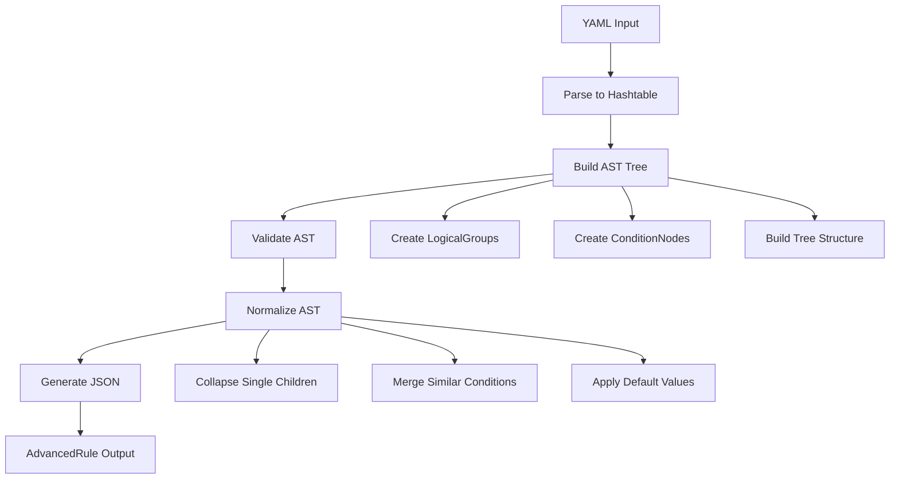

# Enhanced DLP Rule Authoring Schema Design Specification

## Overview

This specification defines improved YAML schema conventions and mapping strategy for Advanced DLP rule authoring in the DLPaC module. The design addresses current limitations in the flat condition array approach and introduces support for complex logical structures, nested grouping, and extensible helper function architecture.

### Current Implementation Analysis

**Current Limitations:**
- Flat array of conditions with implicit AND operator only (see [`DLPaC/Classes/Rule.ps1`](DLPaC/Classes/Rule.ps1:118))
- No support for OR, NOT, or complex nested logical structures
- Hardcoded condition type mapping in `CreateAdvancedRuleJson()`
- Tightly coupled parameter translation in [`ToIPPSPParameters()`](DLPaC/Classes/Rule.ps1:63)
- Limited action types (BlockAccess, Encrypt) with switch-based handling
- No explicit support for endpoint restrictions or advanced alert properties

**Current JSON Structure:**
```json
{
  "Version": "1.0",
  "Condition": {
    "Operator": "And",
    "SubConditions": [...]
  }
}
```

## Enhanced YAML Schema

### Logical Condition Schema

The enhanced schema supports three logical operators with unlimited nesting depth:

```yaml
conditions:
  # Simple flat conditions (backward compatible)
  - type: "SensitiveInfoType"
    infoType: "CreditCardNumber"
    minCount: 1
    
  # Logical grouping with allOf (AND)
  - allOf:
      - type: "SensitiveInfoType"
        infoType: "SSN"
        minCount: 1
      - type: "AccessScope"
        value: "NotInOrganization"
        
  # Logical grouping with anyOf (OR)
  - anyOf:
      - type: "ContentContainsPattern"
        pattern: "CreditCardNumber"
      - type: "SensitiveInfoType"
        infoType: "BankAccountNumber"
        
  # Logical grouping with exceptAnyOf (NOT OR)
  - exceptAnyOf:
      - type: "RecipientDomain"
        operator: "Equals"
        value: "trusted-partner.com"
      - type: "RecipientDomain"
        operator: "Equals"
        value: "internal.company.com"
        
  # Nested logical structures
  - allOf:
      - anyOf:
          - type: "SensitiveInfoType"
            infoType: "SSN"
          - type: "SensitiveInfoType"
            infoType: "ITIN"
      - exceptAnyOf:
          - type: "AccessScope"
            value: "InOrganization"
```

### Extended Condition Types

Current types extended with future placeholders:

```yaml
# Existing types
- type: "ContentContainsPattern"
  pattern: "CreditCardNumber"
  minCount: 1
  confidence: "High"  # New: Classification confidence

- type: "SensitiveInfoType"
  infoType: "SSN"
  minCount: 1
  confidence: "Medium"
  
- type: "RecipientDomain"
  operator: "NotEquals"
  value: "external.com"
  
- type: "AccessScope"
  value: "NotInOrganization"

# Future extension placeholders
- type: "FileExtension"
  extensions: ["pdf", "docx", "xlsx"]
  
- type: "ContentProperty"
  property: "Size"
  operator: "GreaterThan"
  value: "10MB"
  
- type: "EndpointDeviceGroup"
  groups: ["BYOD", "Unmanaged"]
  
- type: "UserGroup"
  groups: ["Finance", "Executives"]
  
- type: "DocumentClassification"
  labels: ["Confidential", "Restricted"]
```

### Enhanced Actions Schema

```yaml
actions:
  # Enhanced existing actions
  - type: "BlockAccess"
    notifyUser: true
    userNotification:
      template: "custom-block-template"
      customMessage: "Financial data sharing blocked"
    notifyAdmin: true
    adminNotification:
      recipients: ["security@company.com"]
      severity: "High"
    auditLog: true
    
  - type: "Encrypt"
    rmsTemplate: "Company Confidential"
    allowDecryption: false
    
  # Future action types
  - type: "NotifyOnly"
    severity: "Medium"
    recipients: ["compliance@company.com"]
    
  - type: "Audit"
    logLevel: "Detailed"
    retention: "7years"
    
  - type: "Quarantine"
    duration: "7days"
    reviewRequired: true
    
  - type: "ApplyLabel"
    label: "Sensitive"
    classification: "Automatic"
```

## JSON Target Shape for AdvancedRule

### Canonical JSON Structure

```json
{
  "Version": "1.0",
  "Condition": {
    "Operator": "And|Or|Not",
    "SubConditions": [
      {
        "ConditionName": "ContentContainsSensitiveInformation",
        "Value": [
          {
            "groups": [
              {
                "name": "Group1",
                "operator": "Or",
                "sensitivetypes": [
                  {
                    "name": "CreditCardNumber",
                    "minCount": 1,
                    "confidence": "High"
                  }
                ]
              }
            ]
          }
        ]
      },
      {
        "Operator": "Not",
        "SubConditions": [
          {
            "ConditionName": "RecipientDomainIs",
            "Value": ["trusted.com"]
          }
        ]
      }
    ]
  }
}
```

### Normalization Rules

1. **Single-child group collapse**: Groups with one condition should be flattened
2. **Canonical operator ordering**: And > Or > Not for consistent structure
3. **Condition consolidation**: Multiple similar conditions should be merged when possible
4. **Default value injection**: Apply default values for optional properties
5. **Type-specific validation**: Ensure condition-specific requirements are met

## Intermediate AST Design

### Core AST Objects

```powershell
# Intermediate representation objects
class DLPLogicalGroup {
    [string] $Type  # AllOf, AnyOf, ExceptAnyOf
    [System.Collections.ArrayList] $Children
    [hashtable] $Metadata
    
    [void] AddChild([object] $Child)
    [bool] Validate()
    [hashtable] ToJson()
    [DLPLogicalGroup] Normalize()
}

class DLPConditionNode {
    [string] $Type
    [hashtable] $Properties
    [hashtable] $Metadata
    
    [bool] Validate()
    [hashtable] ToJson()
    [string] GetConditionName()
}

class DLPRuleAST {
    [DLPLogicalGroup] $RootCondition
    [System.Collections.ArrayList] $Actions
    [hashtable] $Metadata
    
    [bool] Validate()
    [string] ToAdvancedRuleJson()
    [DLPRuleAST] Normalize()
}
```

### AST Construction Flow



## Transformation Algorithm

### Step-by-Step Process

1. **Parse YAML**: Convert YAML to PowerShell hashtable
2. **Build AST**: Recursively construct AST tree from hashtable
3. **Validate Structure**: Check for semantic errors and invalid combinations
4. **Normalize Tree**: Apply optimization and standardization rules
5. **Generate JSON**: Convert AST to Microsoft AdvancedRule JSON format
6. **Validate Output**: Ensure generated JSON meets Microsoft requirements

### Mapping Rules

**YAML to AST Mapping:**
- `allOf` → `DLPLogicalGroup` with Type="AllOf"
- `anyOf` → `DLPLogicalGroup` with Type="AnyOf" 
- `exceptAnyOf` → `DLPLogicalGroup` with Type="ExceptAnyOf"
- Condition objects → `DLPConditionNode`

**AST to JSON Mapping:**
- `AllOf` → `"Operator": "And"`
- `AnyOf` → `"Operator": "Or"`
- `ExceptAnyOf` → `"Operator": "Not"` wrapping `"Operator": "Or"`

## Helper Function Architecture

### Core Helper Functions

| Function Name | Responsibility | Input | Output |
|---------------|----------------|-------|--------|
| [`Convert-DlpYamlToRuleAst`](DLPaC/Private/Convert-DlpYamlToRuleAst.ps1:1) | Parse YAML conditions to AST | Hashtable | DLPRuleAST |
| [`Test-DlpRuleAst`](DLPaC/Private/Test-DlpRuleAst.ps1:1) | Semantic validation of AST | DLPRuleAST | ValidationResult |
| [`Convert-DlpRuleAstToAdvancedRuleJson`](DLPaC/Private/Convert-DlpRuleAstToAdvancedRuleJson.ps1:1) | AST to JSON conversion | DLPRuleAST | String (JSON) |
| [`New-DlpAdvancedRuleParameterSet`](DLPaC/Private/New-DlpAdvancedRuleParameterSet.ps1:1) | Merge JSON with action params | JSON, Actions | Hashtable |
| [`Get-DlpEndpointRestrictionParameters`](DLPaC/Private/Get-DlpEndpointRestrictionParameters.ps1:1) | Future endpoint restrictions | EndpointConfig | Hashtable |
| [`Get-DlpAlertProperties`](DLPaC/Private/Get-DlpAlertProperties.ps1:1) | Future alert configuration | AlertConfig | Hashtable |

### Function Contracts

#### Convert-DlpYamlToRuleAst
```powershell
<#
.SYNOPSIS
Converts YAML condition structure to intermediate AST representation.

.PARAMETER ConditionsHashtable
Hashtable representing the conditions section from YAML.

.PARAMETER ValidationMode
Optional validation mode: Strict, Permissive, or None.

.OUTPUTS
DLPRuleAST object representing the condition tree.
#>
function Convert-DlpYamlToRuleAst {
    param(
        [Parameter(Mandatory)]
        [hashtable] $ConditionsHashtable,
        
        [ValidateSet('Strict', 'Permissive', 'None')]
        [string] $ValidationMode = 'Strict'
    )
}
```

#### Test-DlpRuleAst
```powershell
<#
.SYNOPSIS
Performs semantic validation on DLP rule AST.

.PARAMETER RuleAst
The AST to validate.

.PARAMETER IncludeWarnings
Include non-critical warnings in validation results.

.OUTPUTS
ValidationResult object with success status and error details.
#>
function Test-DlpRuleAst {
    param(
        [Parameter(Mandatory)]
        [DLPRuleAST] $RuleAst,
        
        [switch] $IncludeWarnings
    )
}
```

### Integration Points

The helper functions integrate with existing classes:

```powershell
# Enhanced Rule class method
[string] CreateAdvancedRuleJson() {
    # Use new helper pipeline
    $ast = Convert-DlpYamlToRuleAst -ConditionsHashtable $this.GetConditionsHashtable()
    $validationResult = Test-DlpRuleAst -RuleAst $ast
    
    if (-not $validationResult.IsValid) {
        throw "Rule validation failed: $($validationResult.Errors -join ', ')"
    }
    
    return Convert-DlpRuleAstToAdvancedRuleJson -RuleAst $ast
}

# Enhanced parameter generation
[hashtable] ToIPPSPParameters([bool]$ForUpdate) {
    $advancedRule = $this.CreateAdvancedRuleJson()
    $actionParams = $this.GetActionParameters()
    
    return New-DlpAdvancedRuleParameterSet -AdvancedRuleJson $advancedRule -Actions $actionParams -ForUpdate $ForUpdate
}
```

## Action Mapping Strategy

### Current vs Enhanced Approach

**Current (Switch-based):**
```powershell
foreach ($action in $this.Actions) {
    switch ($action.Type) {
        "BlockAccess" { $params.BlockAccess = $true }
        "Encrypt" { $params.EncryptRMSTemplate = $action.RMSTemplate }
    }
}
```

**Enhanced (Table-driven):**
```powershell
# Action mapping table
$ActionMappings = @{
    'BlockAccess' = @{
        PrimaryParameter = 'BlockAccess'
        ValueMapping = @{ $true = $true }
        ConditionalParameters = @{
            'NotifyUser' = @{
                Parameter = 'GenerateIncidentReport'
                ValueMapping = @{ $true = 'All'; $false = $null }
            }
        }
    }
    'Encrypt' = @{
        PrimaryParameter = 'EncryptRMSTemplate'
        ValueMapping = 'Direct'  # Use property value directly
        PropertySource = 'RMSTemplate'
    }
    'NotifyOnly' = @{
        PrimaryParameter = 'GenerateIncidentReport'
        ValueMapping = @{ $true = 'All' }
        ConditionalParameters = @{
            'Recipients' = @{
                Parameter = 'IncidentReportContent'
                ValueMapping = 'Direct'
            }
        }
    }
}
```

### Extension Pattern

New action types can be added without code changes:
```powershell
# Register new action type
Register-DlpActionMapping -ActionType 'Quarantine' -Mapping @{
    PrimaryParameter = 'QuarantineLocation'
    ValueMapping = 'Direct'
    PropertySource = 'Location'
    ConditionalParameters = @{
        'Duration' = @{
            Parameter = 'QuarantineDuration'
            ValueMapping = 'Direct'
        }
    }
}
```

## YAML Examples and JSON Output

### Example 1: Simple Nested Logic
```yaml
# YAML Input
conditions:
  - allOf:
      - type: "SensitiveInfoType"
        infoType: "CreditCardNumber"
        minCount: 1
      - anyOf:
          - type: "AccessScope"
            value: "NotInOrganization"
          - exceptAnyOf:
              - type: "RecipientDomain"
                operator: "Equals"
                value: "trusted.com"
```

```json
// Generated JSON
{
  "Version": "1.0",
  "Condition": {
    "Operator": "And",
    "SubConditions": [
      {
        "ConditionName": "ContentContainsSensitiveInformation",
        "Value": [
          {
            "groups": [
              {
                "name": "Default",
                "operator": "Or",
                "sensitivetypes": [
                  {
                    "name": "CreditCardNumber",
                    "minCount": 1
                  }
                ]
              }
            ]
          }
        ]
      },
      {
        "Operator": "Or",
        "SubConditions": [
          {
            "ConditionName": "AccessScope",
            "Value": ["NotInOrganization"]
          },
          {
            "Operator": "Not",
            "SubConditions": [
              {
                "Operator": "Or",
                "SubConditions": [
                  {
                    "ConditionName": "RecipientDomainIs",
                    "Value": ["trusted.com"]
                  }
                ]
              }
            ]
          }
        ]
      }
    ]
  }
}
```

### Example 2: Multiple Sensitive Info Groups
```yaml
# YAML Input
conditions:
  - anyOf:
      - allOf:
          - type: "SensitiveInfoType"
            infoType: "SSN"
            minCount: 2
          - type: "SensitiveInfoType"
            infoType: "CreditCardNumber"
            minCount: 1
      - type: "SensitiveInfoType"
        infoType: "BankAccountNumber"
        minCount: 3
```

```json
// Generated JSON - Optimized with multiple groups
{
  "Version": "1.0",
  "Condition": {
    "ConditionName": "ContentContainsSensitiveInformation",
    "Value": [
      {
        "groups": [
          {
            "name": "Group1",
            "operator": "And",
            "sensitivetypes": [
              {
                "name": "SSN",
                "minCount": 2
              },
              {
                "name": "CreditCardNumber", 
                "minCount": 1
              }
            ]
          },
          {
            "name": "Group2",
            "operator": "Or",
            "sensitivetypes": [
              {
                "name": "BankAccountNumber",
                "minCount": 3
              }
            ]
          }
        ]
      }
    ]
  }
}
```

## Validation Strategy

### Schema-Level Validation

Enhanced JSON Schema in [`DLPaC/Schemas/policy-schema.json`](DLPaC/Schemas/policy-schema.json:1):

```json
{
  "conditions": {
    "oneOf": [
      {
        "type": "array",
        "items": { "$ref": "#/definitions/condition" }
      },
      {
        "type": "array", 
        "items": { "$ref": "#/definitions/logicalGroup" }
      }
    ]
  },
  "definitions": {
    "logicalGroup": {
      "type": "object",
      "oneOf": [
        {
          "properties": {
            "allOf": { 
              "type": "array",
              "items": { "$ref": "#/definitions/conditionOrGroup" }
            }
          },
          "required": ["allOf"],
          "additionalProperties": false
        },
        {
          "properties": {
            "anyOf": {
              "type": "array", 
              "items": { "$ref": "#/definitions/conditionOrGroup" }
            }
          },
          "required": ["anyOf"],
          "additionalProperties": false  
        },
        {
          "properties": {
            "exceptAnyOf": {
              "type": "array",
              "items": { "$ref": "#/definitions/conditionOrGroup" }
            }
          },
          "required": ["exceptAnyOf"],
          "additionalProperties": false
        }
      ]
    },
    "conditionOrGroup": {
      "oneOf": [
        { "$ref": "#/definitions/condition" },
        { "$ref": "#/definitions/logicalGroup" }
      ]
    }
  }
}
```

### Semantic Validation

Runtime validation in [`Test-DlpRuleAst`](DLPaC/Private/Test-DlpRuleAst.ps1:1):

1. **Mutual Exclusion Checks**: Ensure incompatible conditions aren't combined
2. **Depth Limits**: Prevent excessive nesting (recommended max: 5 levels)
3. **Performance Validation**: Warn on complex rules that may impact performance
4. **Logic Consistency**: Validate that logical combinations make sense
5. **Microsoft Limits**: Ensure generated JSON stays within Microsoft's limits

### Validation Error Examples

```powershell
# Semantic validation errors
ValidationResult @{
    IsValid = $false
    Errors = @(
        "Excessive nesting depth (7 levels) exceeds recommended maximum (5)",
        "Conflicting conditions: AccessScope 'InOrganization' and 'NotInOrganization' in same AND group",
        "Performance warning: Rule contains >50 condition nodes"
    )
    Warnings = @(
        "Consider simplifying nested OR groups for better readability"
    )
}
```

## Future Extensibility Hooks

### Endpoint DLP Integration Points

```yaml
# Future endpoint restrictions
endpointRestrictions:
  deviceGroups: ["BYOD", "Unmanaged"]
  applications: 
    block: ["PersonalEmail", "CloudStorage"]
    audit: ["WebBrowser", "USBStorage"]
  fileActions:
    upload: "Block"
    download: "Audit" 
    print: "Notify"
```

### Advanced Alert Properties

```yaml
# Future alert enhancements
alertProperties:
  severity: "High"
  classification: "DataLoss"
  customFields:
    department: "Finance"
    riskScore: 85
  escalation:
    threshold: 3
    recipients: ["security-team@company.com"]
  retention: "7years"
```

### Plugin Architecture

```powershell
# Future plugin registration
Register-DlpConditionPlugin -Name "CustomScannerResult" -Handler {
    param($Properties)
    return @{
        ConditionName = "CustomCondition"
        Value = @{ ScannerType = $Properties.Scanner }
    }
}
```

## Migration Strategy

### Backward Compatibility

1. **Flat condition arrays remain supported** - existing YAML continues to work
2. **Automatic upgrade path** - flat arrays can be automatically converted to `allOf` groups
3. **Gradual adoption** - new logical operators can be added incrementally to existing policies

### Migration Helper

```powershell
# Conversion utility
function Convert-DlpLegacyRule {
    param([DLPaCRule] $LegacyRule)
    
    if ($LegacyRule.Conditions.Count -gt 1) {
        # Convert to allOf structure
        return @{
            allOf = $LegacyRule.Conditions | ForEach-Object { $_.ToHashtable() }
        }
    }
    else {
        # Keep simple structure
        return $LegacyRule.Conditions[0].ToHashtable()
    }
}
```

### Phased Implementation

1. **Phase 1**: Implement AST objects and basic helper functions
2. **Phase 2**: Add logical operator support (allOf, anyOf, exceptAnyOf)
3. **Phase 3**: Implement advanced condition types and validation
4. **Phase 4**: Add action mapping table and extensibility hooks
5. **Phase 5**: Implement endpoint and alert property extensions

## Design Rationale

### Key Design Decisions

**AST Intermediate Representation**:
- **Rationale**: Provides clean separation between YAML parsing and JSON generation
- **Benefits**: Enables validation, optimization, and future format support
- **Trade-offs**: Additional complexity vs. maintainability and extensibility

**Table-Driven Action Mapping**:
- **Rationale**: Eliminates hardcoded switch statements for better extensibility
- **Benefits**: Easy addition of new action types without code changes
- **Trade-offs**: Slight performance overhead vs. significant maintainability improvement

**Recursive Logical Structure**:
- **Rationale**: Supports complex business logic requirements
- **Benefits**: Unlimited nesting, intuitive YAML syntax, powerful rule expression
- **Trade-offs**: Complexity vs. expressiveness

**Modular Helper Functions**:
- **Rationale**: Single responsibility principle, testability, reusability
- **Benefits**: Each function has clear purpose, easier testing, better error handling
- **Trade-offs**: More functions to maintain vs. better organization

**Normalization Rules**:
- **Rationale**: Ensures consistent JSON output regardless of YAML structure variations
- **Benefits**: Predictable behavior, optimized output, reduced Microsoft API variations
- **Trade-offs**: Processing overhead vs. consistency and reliability

This design provides a solid foundation for advanced DLP rule authoring while maintaining backward compatibility and enabling future extensibility.

## Compatibility Validation Layer

### Purpose
Pre-deployment detection of unsupported action/condition/scope combinations during planning and configuration testing. This layer prevents generating plans that would fail in Microsoft 365 by validating the normalized rule AST against a set of compatibility rules.

- Runs during planning via [PowerShell.Get-DLPaCPlan()](DLPaC/Public/Get-DLPaCPlan.ps1:1) and during configuration validation via [PowerShell.Test-DLPaCConfiguration()](DLPaC/Public/Test-DLPaCConfiguration.ps1:1).
- Findings with severity "error" abort the operation; "warn" findings are logged and the process continues.

### Files and Locations
- Defaults (module-provided): [DLPaC/Rules/compatibility-rules.yaml](DLPaC/Rules/compatibility-rules.yaml:1)
- Workspace overrides (organization-specific): [.dlpac/compatibility-overrides.yaml](.dlpac/compatibility-overrides.yaml:1)

When a workspace is initialized with [PowerShell.Initialize-DLPaCWorkspace()](DLPaC/Public/Initialize-DLPaCWorkspace.ps1:1), an overrides file is scaffolded under `.dlpac/` for local customization.

### Rule Schema
Each rule is defined in YAML with the following fields and behavior:

- id: Unique, case-insensitive identifier (string).
- description: Human-readable description of the compatibility constraint.
- severity: One of "error" or "warn".
  - error: Aborts [PowerShell.Get-DLPaCPlan()](DLPaC/Public/Get-DLPaCPlan.ps1:1) and [PowerShell.Test-DLPaCConfiguration()](DLPaC/Public/Test-DLPaCConfiguration.ps1:1).
  - warn: Logs finding via [PowerShell.DLPaCLogger](DLPaC/Classes/Logger.ps1:1) and proceeds.
- enabled: Boolean, default true.
- match: Matching criteria against the normalized AST:
  - actions_any_of: One or more action identifiers (case-insensitive).
  - conditions_any_of: Optional; one or more condition identifiers (case-insensitive).
  - scopes_any_of: One or more workload scopes (e.g., sharepoint, onedrive, exchange, teams, devices).
  - scopes_all_of: All listed scopes must be present.
- message: End-user facing message explaining the incompatibility.
- suggestion: Operator/developer guidance to resolve or avoid the issue.

Behavioral notes:
- All identifiers are case-insensitive.
- Single scalar values are coerced to arrays for actions/conditions/scopes.
- Rules evaluate against the normalized AST produced by [PowerShell.Convert-DlpYamlToRuleAst()](DLPaC/Private/Convert-DlpYamlToRuleAst.ps1:1); no raw YAML parsing.

### Merge and Precedence
- Defaults are loaded first from [DLPaC/Rules/compatibility-rules.yaml](DLPaC/Rules/compatibility-rules.yaml:1).
- Workspace overrides in [.dlpac/compatibility-overrides.yaml](.dlpac/compatibility-overrides.yaml:1):
  - Replace-by-id semantics: an override with the same id replaces the default (you can modify severity, enabled, messages, or match).
  - New rules can be added by specifying new ids.
  - Rules can be disabled by setting enabled: false.
- Effective rules = defaults merged with overrides; only enabled rules are enforced.

### Integrations
- Planner: [PowerShell.Get-DLPaCPlan()](DLPaC/Public/Get-DLPaCPlan.ps1:1) runs compatibility validation after building the normalized AST. Plans abort on "error" findings; "warn" findings persist.
- Config test: [PowerShell.Test-DLPaCConfiguration()](DLPaC/Public/Test-DLPaCConfiguration.ps1:1) fails on "error" findings.
- Findings are persisted on the plan as [PowerShell.DLPaCPlan.CompatibilityFindings](DLPaC/Classes/Plan.ps1:1) for later inspection and reporting.

### Baseline rule example (SPO/OneDrive Encrypt unsupported)
The following baseline illustrates a rule that flags Encrypt actions in SharePoint and OneDrive as incompatible:

```yaml
# From defaults: DLPaC/Rules/compatibility-rules.yaml
- id: "encrypt-spo-od-unsupported"
  description: "Encrypt action is not supported for SharePoint Online and OneDrive scopes"
  severity: "error"
  enabled: true
  match:
    actions_any_of: ["encrypt"]
    scopes_any_of: ["sharepoint", "onedrive"]
  message: "Encrypt is not supported for SharePoint or OneDrive."
  suggestion: "Use BlockAccess or a supported action for SPO/OneDrive, or scope Encrypt to Exchange/Teams only."
```

Reference test demonstrating this condition: [Test/configs/incompatible-encrypt-spo-od.yaml](Test/configs/incompatible-encrypt-spo-od.yaml:1)

### Workspace overrides (disable or downgrade severity)
Place org-specific overrides in [.dlpac/compatibility-overrides.yaml](.dlpac/compatibility-overrides.yaml:1).

- Disable the baseline rule entirely:
```yaml
- id: "encrypt-spo-od-unsupported"
  enabled: false
  description: "Org override: temporarily disable SPO/OD Encrypt compatibility check"
```

- Downgrade severity from error to warn and adjust guidance:
```yaml
- id: "encrypt-spo-od-unsupported"
  severity: "warn"
  message: "Encrypt on SPO/OD is discouraged in this environment."
  suggestion: "Proceed only for pilot sites; plan migration to BlockAccess where feasible."
```

- Add a new org-specific rule:
```yaml
- id: "block-devices-scope-constraint"
  description: "BlockAccess with devices scope requires notifyUser"
  severity: "warn"
  enabled: true
  match:
    actions_any_of: ["blockaccess"]
    scopes_any_of: ["devices"]
    conditions_any_of: []  # optional
  message: "Blocking on devices without user notification reduces effectiveness."
  suggestion: "Set actions.notifyUser: true for device-scoped blocking."
```

### Notes
- Source of truth is the normalized AST from [PowerShell.Convert-DlpYamlToRuleAst()](DLPaC/Private/Convert-DlpYamlToRuleAst.ps1:1); rules evaluate against canonicalized identifiers and shapes.
- Logging uses [PowerShell.DLPaCLogger](DLPaC/Classes/Logger.ps1:1). Do not use Write-Host in cmdlets.
- YAML keys are normalized and non-array nodes are coerced to arrays earlier in the pipeline by the normalizer in [DLPaC/Private/Normalize-Keys.ps1](DLPaC/Private/Normalize-Keys.ps1:1).

### Offline CLI examples
Run planning and validation without tenant connectivity to surface compatibility findings early:

```powershell
# Validate configuration (schema + compatibility); fails on error findings
Test-DLPaCConfiguration -Path "./dlp-workspace/configs" -Detailed

# Generate a plan offline; aborts on error findings, persists warnings
Get-DLPaCPlan -ConfigPath "./dlp-workspace/configs" -NoConnect -Detailed
```

Findings are saved on the plan object under [PowerShell.DLPaCPlan.CompatibilityFindings](DLPaC/Classes/Plan.ps1:1) and are also logged via [PowerShell.DLPaCLogger](DLPaC/Classes/Logger.ps1:1).
